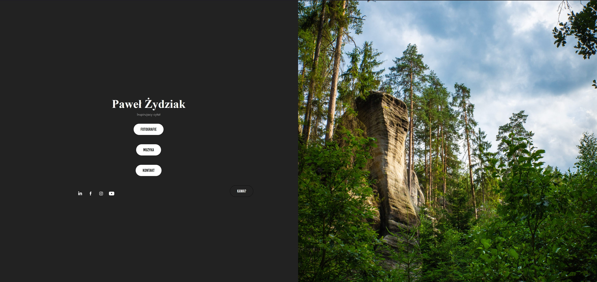
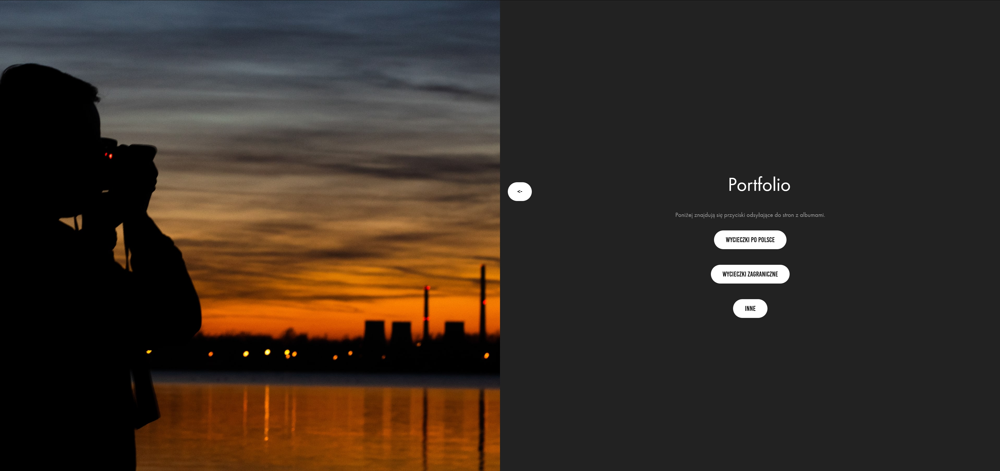
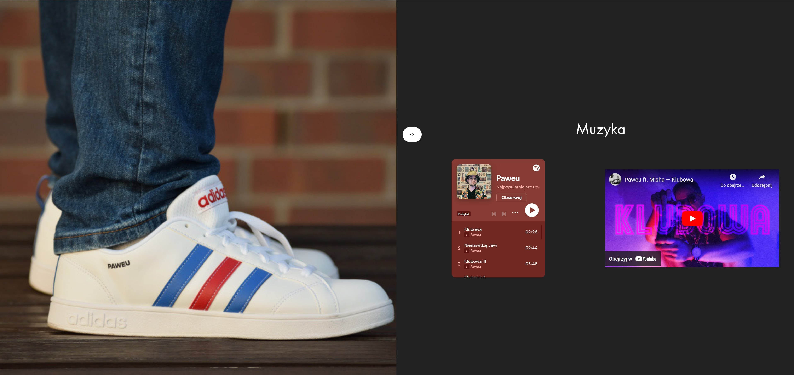
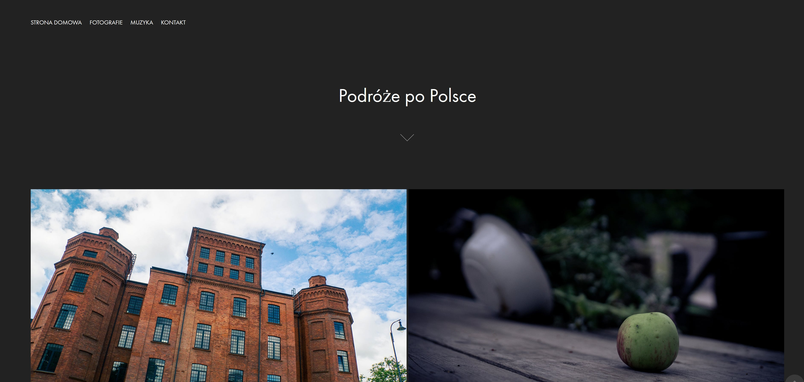
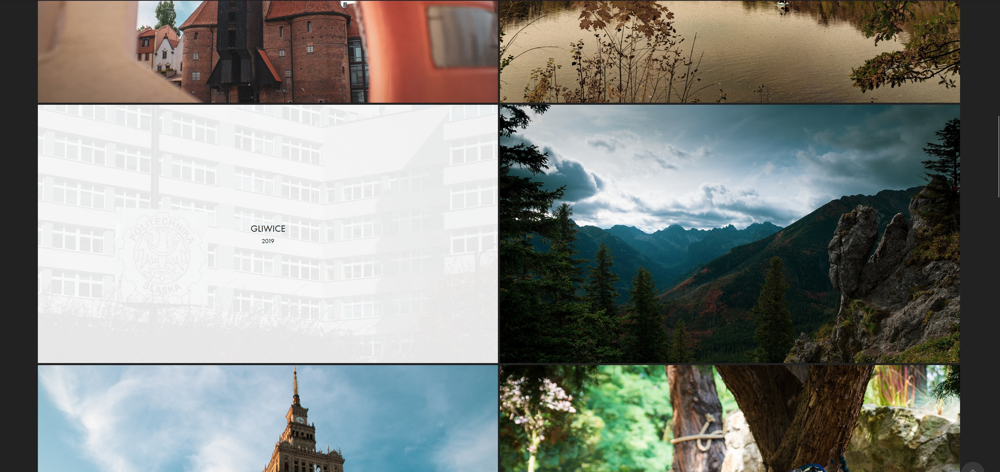

### Paweumuau Photos site migration from Adobe Portfolio

Since the Adobe is rising the price for the Portfolio service, I decided to migrate my photos site to the custom one. 
Adobe doens't allow for any kind of export, so I had to do it manually from scratch.

I decided to use the next.js. This is the first time I'm writing frontend, so I'm learning as I go.

Original portfolio site screenshots, for future reference (when Adobe kills it):

